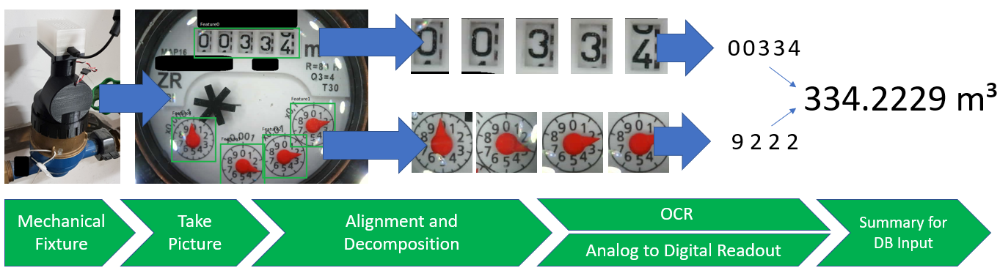
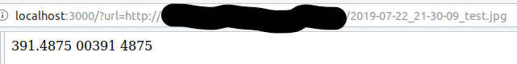
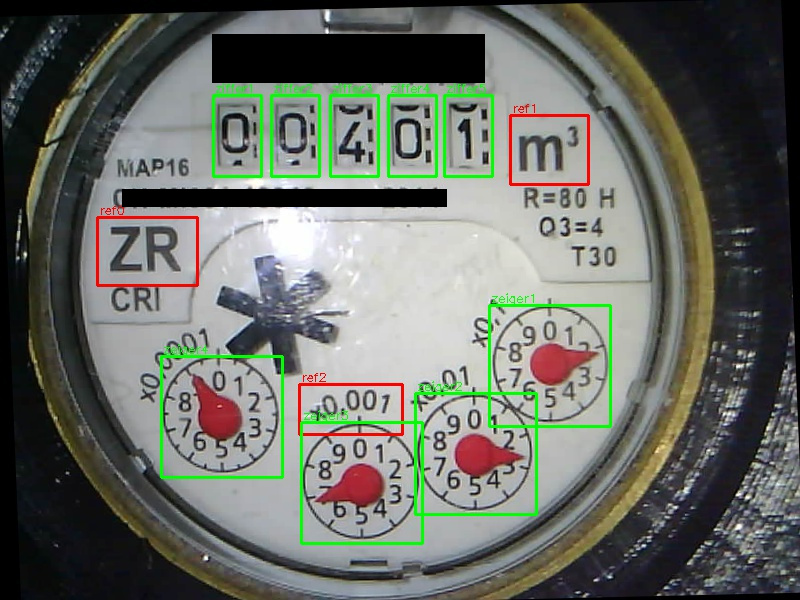

# water-meter-system-complete

This repository is the sum of different projects to read out an analog water meter with the help of a camera and image processing, including neural network processing to extract the values.
The result is a HTTP-server, that takes an image as input, processes it and gives as an output the water meter number, including the subdigits.

## Changelog - lastest version
##### 2.2.0 (2019-09-18)
* Update neural network for readout analog meter
* storage and usage of last full readouts to substitute "NaN" values in digital counters
### [Full Changelog](Changelog.md)

The overall system with description of the single steps is described here: [https://github.com/jomjol/water-meter-measurement-system](https://github.com/jomjol/water-meter-measurement-system)

A graphical overview about the steps is shown in the following flow:

 

## Setup

To run the Python code copy the whole [code](code) directory including subdirectory.

Path are relative, so it should run immediatly with the following command:
* `pip install requirements.txt`
* `python wasserzaehler.py`

### Configuration

The configuration is storred in the subdirectory `config`. In the Ini-file the CNN-Network to be loaded is listed. Configuration of the neural network (*.h5) itself is stored in the subdirectory `neuralnets`.
Detailed information on config.ini see [Config_Description.md](Config_Description.md)

		
	
## Running the server

The server is listening to port 3000 and accepts requests in the following syntac:

* http://server-ip:3000/wasserzaehler.html

| Parameter | Meaning | example |
| --------- | ------- | ------- |
| server-ip | address of the node-server running the script | `localhost` |

Without any parameter and correct setting in the CONFIG.INI the server responses with an readout of the water meter:

The output of the server are 3 numbers, separated by a tabulator.

| Number | Meaning | 
| --------- | ------- |
| First number | Full readout, including main digits and subdigits, leading zeros are suppresed |
| Second number | Direct readout of the digital digits, including leading zeros |
| Third number | post digit numbers |

##### Remark
If a digit cannot be recognized, e.g. because it is half between 2 digits, then instead of the number a "N" is written at the corresponding position. In this case a direct conversion to a number will not work. Additional information (e.g. last valid full reading) needs to be used to extrapolate the missing digit (see below).

### Optional parameters

* http://server-ip:3000/wasserzaehler.html?url=http://picture-server/image.jpg&full
* http://server-ip:3000/wasserzaehler.html?usePreValue

| Parameter | Meaning | example |
| url | url to a dedicated picture to be analysed | `url=http://picture-server/image.jpg` |
| full | response extended by details on readout process | `full` |
| usePreValue | if available the last fully valid readout is used to complete unambigoius digits ('N'). The prevalue can be set manuelly by 'setPreValue.html' - see below | `usePreValue` |#

If `full` is set the output contains the analysed image:

## Additional Settings
* http://server-ip:3000/roi.html

The page `roi.html` return the image including the ROIs visible. This is usefull to check for correct setting:

* http://server-ip:3000/setPreValue.html?value=401.57

The page `setPreValue.html` stores the number given in the parameter `value` to initiate the internal storage of a valid data. This can be used, in case the digital counter is between two number and cannot be readout uniquely at the moment.

| Parameter | Meaning | example |
| --------- | ------- | ------- |
| value | valid setting of water meter readout | `value=401.57` |

   

